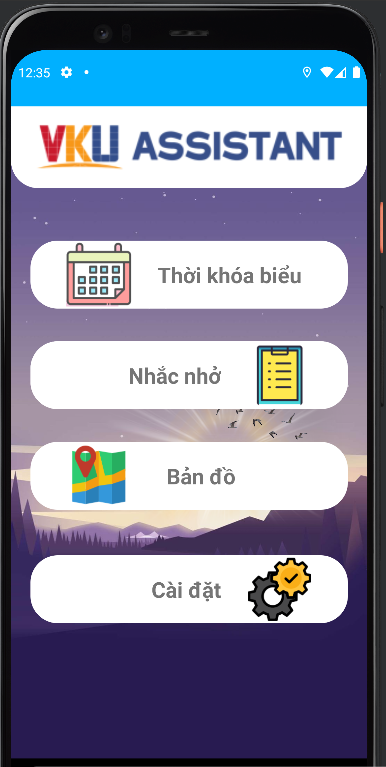

# VKU ASSISTANT

VKU Assistant là ứng dụng hỗ trợ sinh viên trong quá trình học tập

  <kbd>
    
  </kbd>

## Các chức năng chính
- Hỗ trợ sinh viên quản lí lịch học
- Nhắc nhở sinh viên đi học đúng giờ
- Nhắc nhở sinh viên làm bài tập, deadline
- Tính toán quãng đường, thời gian từ địa điểm hiện tại tới trường.
